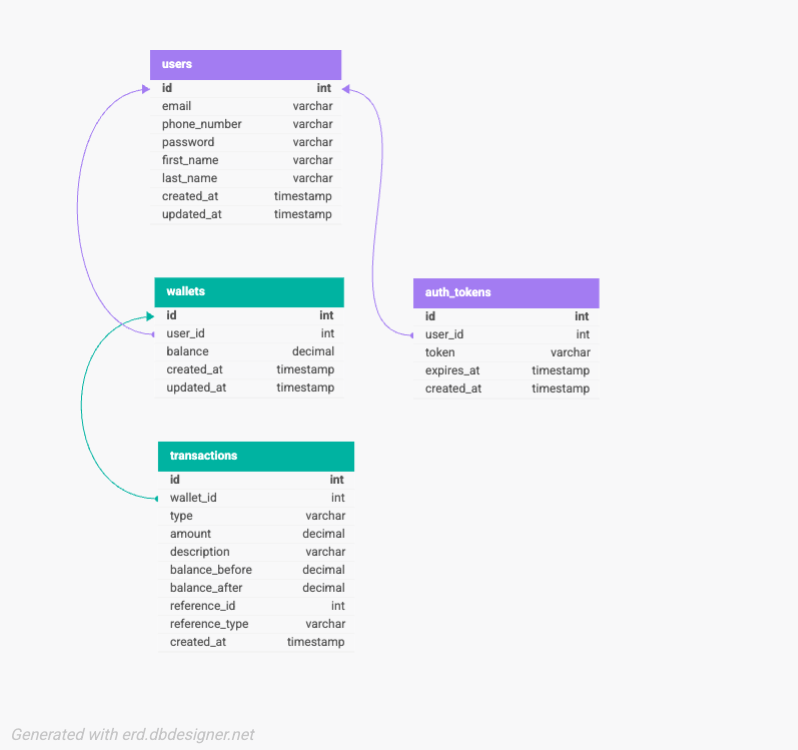

# Lendsqr Wallet System - Design Document

> **Credit Wallet Service [Demo]** - A secure, scalable, and production-ready wallet API built with Node.js, TypeScript, and MySQL.

[](https://www.typescriptlang.org/)
[](https://nodejs.org/)
[](https://www.mysql.com/)
[](https://jestjs.io/)
[](LICENSE)

---

## Table of Contents

1. [Project Overview](#project-overview)
2. [Database Design](#database-design)
3. [Architecture & Design Patterns](#architecture--design-patterns)
4. [Project Structure](#project-structure)
5. [Setup & Installation](#setup--installation)
6. [API Documentation](#api-documentation)
7. [Testing](#testing)
8. [Security Considerations](#security-considerations)

---

## Project Overview

This is a comprehensive wallet management system that demonstrates production-grade backend development practices. The system allows users to:

- **Create accounts** with blacklist verification
- **Fund wallets** with atomic transactions
- **Transfer funds** between users with row-level locking
- **Withdraw funds** with balance validation
- **View transaction history** with pagination

### Key Technical Features

- ✅ **ACID Transactions** - Database transactions with atomicity guarantees
- ✅ **Row-Level Locking** - `SELECT FOR UPDATE` prevents race conditions
- ✅ **Fail-Safe Design** - Blacklist API failures deny onboarding by default
- ✅ **Password Security** - Bcrypt hashing with salt rounds
- ✅ **Token-based Auth** - Secure session management
- ✅ **Comprehensive Testing** - 56 tests covering unit and integration scenarios
- ✅ **Type Safety** - Full TypeScript implementation
- ✅ **API Standards** - RESTful design with proper HTTP semantics

---

## Database Design

### E-R Diagram



**Relationships:**
- **Users → Wallets**: One-to-One (Each user has exactly one wallet)
- **Users → Auth Tokens**: One-to-Many (User can have multiple active sessions)
- **Wallets → Transactions**: One-to-Many (Wallet has multiple transactions)

**Key Constraints:**
- `wallets.user_id`: UNIQUE (enforces one wallet per user)
- `users.email`: UNIQUE (no duplicate emails)
- `users.phone_number`: UNIQUE (no duplicate phones)
- `auth_tokens.token`: UNIQUE (each token is unique)
- All foreign keys have CASCADE DELETE for referential integrity

### Database Schema

#### **Users Table**
```sql
CREATE TABLE users (
  id INT UNSIGNED AUTO_INCREMENT PRIMARY KEY,
  email VARCHAR(255) UNIQUE NOT NULL,
  phone_number VARCHAR(20) UNIQUE NOT NULL,
  password VARCHAR(255) NOT NULL,
  first_name VARCHAR(100) NOT NULL,
  last_name VARCHAR(100) NOT NULL,
  created_at TIMESTAMP DEFAULT CURRENT_TIMESTAMP,
  updated_at TIMESTAMP DEFAULT CURRENT_TIMESTAMP ON UPDATE CURRENT_TIMESTAMP,
  INDEX idx_email (email),
  INDEX idx_phone (phone_number)
);
```

#### **Wallets Table**
```sql
CREATE TABLE wallets (
  id INT UNSIGNED AUTO_INCREMENT PRIMARY KEY,
  user_id INT UNSIGNED UNIQUE NOT NULL,
  balance DECIMAL(15, 2) DEFAULT 0.00 NOT NULL,
  created_at TIMESTAMP DEFAULT CURRENT_TIMESTAMP,
  updated_at TIMESTAMP DEFAULT CURRENT_TIMESTAMP ON UPDATE CURRENT_TIMESTAMP,
  FOREIGN KEY (user_id) REFERENCES users(id) ON DELETE CASCADE,
  INDEX idx_user_id (user_id)
);
```

#### **Transactions Table**
```sql
CREATE TABLE transactions (
  id INT UNSIGNED AUTO_INCREMENT PRIMARY KEY,
  wallet_id INT UNSIGNED NOT NULL,
  type ENUM('credit', 'debit') NOT NULL,
  amount DECIMAL(15, 2) NOT NULL,
  description VARCHAR(500),
  balance_before DECIMAL(15, 2) NOT NULL,
  balance_after DECIMAL(15, 2) NOT NULL,
  reference_id INT UNSIGNED,
  reference_type VARCHAR(50),
  created_at TIMESTAMP DEFAULT CURRENT_TIMESTAMP,
  FOREIGN KEY (wallet_id) REFERENCES wallets(id) ON DELETE CASCADE,
  INDEX idx_wallet_id (wallet_id),
  INDEX idx_created_at (created_at)
);
```

#### **Auth Tokens Table**
```sql
CREATE TABLE auth_tokens (
  id INT UNSIGNED AUTO_INCREMENT PRIMARY KEY,
  user_id INT UNSIGNED NOT NULL,
  token VARCHAR(255) UNIQUE NOT NULL,
  expires_at TIMESTAMP NOT NULL,
  created_at TIMESTAMP DEFAULT CURRENT_TIMESTAMP,
  FOREIGN KEY (user_id) REFERENCES users(id) ON DELETE CASCADE,
  INDEX idx_token (token),
  INDEX idx_user_id (user_id)
);
```

### Database Design Rationale

#### 1. **Users Table**
- **Primary Key**: Auto-increment `id` for internal references
- **Unique Constraints**: Both `email` and `phone_number` to prevent duplicates
- **Password Storage**: Hashed with bcrypt (never stored in plain text)
- **Normalization**: Follows 3NF - no redundant data
- **Indexes**: On email and phone for fast lookups

#### 2. **Wallets Table**
- **One-to-One with Users**: Each user has exactly one wallet (`user_id` is UNIQUE)
- **Balance as DECIMAL(15,2)**: Precise monetary calculations (no floating-point errors)
- **Foreign Key CASCADE**: When user is deleted, wallet is automatically deleted
- **Indexed on user_id**: Fast lookups by user

#### 3. **Transactions Table**
- **Audit Trail**: Immutable record of all wallet operations
- **Double-Entry Bookkeeping**: Every debit has a corresponding credit
- **Balance Snapshots**: `balance_before` and `balance_after` for reconciliation
- **Reference Fields**: Link related transactions (e.g., transfer = 2 transactions)
- **Type ENUM**: Enforces only 'credit' or 'debit' at database level
- **Indexed on wallet_id**: Fast transaction history retrieval
- **Indexed on created_at**: Efficient time-based queries

#### 4. **Auth Tokens Table**
- **Secure Session Management**: Tokens stored hashed
- **Expiration Support**: `expires_at` for automatic invalidation
- **Multiple Sessions**: User can have multiple active tokens
- **Foreign Key CASCADE**: Tokens deleted when user is deleted

### Data Integrity Features

1. **Foreign Keys with CASCADE DELETE**: Maintains referential integrity
2. **Unique Constraints**: Prevents duplicate emails/phones/tokens
3. **NOT NULL Constraints**: Enforces required fields at DB level
4. **DECIMAL for Money**: Avoids floating-point precision issues
5. **Timestamps**: Automatic `created_at` and `updated_at` tracking
6. **ENUM Types**: Restricts transaction types at database level

### Transaction Isolation & Concurrency Control

```sql
-- Example: Transfer with Row Locking
START TRANSACTION;

-- Lock sender's wallet (prevents concurrent modifications)
SELECT * FROM wallets WHERE user_id = ? FOR UPDATE;

-- Lock recipient's wallet
SELECT * FROM wallets WHERE user_id = ? FOR UPDATE;

-- Perform debit and credit operations
UPDATE wallets SET balance = balance - amount WHERE id = sender_wallet_id;
UPDATE wallets SET balance = balance + amount WHERE id = recipient_wallet_id;

-- Record both transactions
INSERT INTO transactions (...);
INSERT INTO transactions (...);

COMMIT;
```

**Why `SELECT FOR UPDATE`?**
- Prevents race conditions when two transfers happen simultaneously
- Ensures balance consistency
- MySQL waits for lock release (queues transactions)
- Tests verify this works with concurrent operations

---

## Architecture & Design Patterns

### Architectural Principles

This project follows **Clean Architecture** and **SOLID principles**:

```
┌─────────────────────────────────────────┐
│         HTTP Layer (Routes)             │
│  - Express routes                       │
│  - Request validation                   │
└──────────────┬──────────────────────────┘
               │
               ▼
┌─────────────────────────────────────────┐
│       Controllers (HTTP Handlers)       │
│  - Request/Response mapping             │
│  - Input validation                     │
│  - Error handling                       │
└──────────────┬──────────────────────────┘
               │
               ▼
┌─────────────────────────────────────────┐
│      Services (Business Logic)          │
│  - UserService                          │
│  - WalletService                        │
│  - AuthService                          │
│  - BlacklistService                     │
└──────────────┬──────────────────────────┘
               │
               ▼
┌─────────────────────────────────────────┐
│      Database Layer (Knex.js)           │
│  - Query builder                        │
│  - Migrations                           │
│  - Transactions                         │
└─────────────────────────────────────────┘
```

### Design Patterns Implemented

#### 1. **Service Pattern**
Encapsulates business logic in reusable service classes.

```typescript
// Business logic encapsulated in services
class WalletService {
  async transfer(senderId: number, recipientId: number, amount: number) {
    return await db.transaction(async (trx) => {
      // Complex business logic with transaction safety
    });
  }
}
```

#### 2. **Dependency Injection**
Services accept dependencies through constructor for testability.

```typescript
class UserService {
  constructor(
    authService?: AuthService,
    blacklistService?: BlacklistService,
    walletService?: WalletService
  ) {
    // Allows mock injection for testing
    this.authService = authService || new AuthService();
    this.blacklistService = blacklistService || new BlacklistService();
    this.walletService = walletService || new WalletService();
  }
}
```

#### 3. **Middleware Pattern**
Reusable request processing chain.

```typescript
// Reusable authentication middleware
export const authenticate = async (req, res, next) => {
  const token = extractToken(req);
  const user = await authService.validateToken(token);
  req.user = user;
  next();
};
```

#### 4. **Singleton Pattern**
Single database connection instance shared across the application.

```typescript
// Single database connection instance
const db: Knex = knex(config);
export default db;
```

#### 5. **Factory Pattern**
Standardized object creation for transactions.

```typescript
private createTransaction(
  walletId: number,
  type: 'credit' | 'debit',
  amount: number,
  description: string,
  balanceBefore: number,
  balanceAfter: number
) {
  return {
    wallet_id: walletId,
    type,
    amount,
    description,
    balance_before: balanceBefore,
    balance_after: balanceAfter,
  };
}
```

### Fail-Safe Design: Blacklist Verification

**Critical Security Requirement**: Users on the blacklist must NEVER be onboarded.

```typescript
// Fail-safe approach: API failure = assume blacklisted
async checkBlacklist(email: string, phone: string): Promise<BlacklistCheckResult> {
  try {
    const response = await fetch(BLACKLIST_API, {
      method: 'POST',
      headers: { 'Content-Type': 'application/json' },
      body: JSON.stringify({ email, identity: phone }),
      signal: AbortSignal.timeout(5000), // 5 second timeout
    });
    
    if (!response.ok) {
      // Treat non-200 responses as blacklisted (fail-safe)
      return {
        isBlacklisted: true,
        reason: 'Unable to verify blacklist status - treating as blacklisted for safety',
      };
    }
    
    const data = await response.json();
    return {
      isBlacklisted: data.status === 'blacklisted' || data.karma?.blacklist === true,
      reason: data.message || 'User verification complete',
    };
  } catch (error) {
    // CRITICAL: Treat API failures as blacklisted (fail-safe)
    return {
      isBlacklisted: true,
      reason: 'Unable to verify blacklist status - denying onboarding for safety',
    };
  }
}
```

**Why this approach?**
- ✅ Network failures don't bypass security
- ✅ API downtime doesn't allow blacklisted users
- ✅ Conservative approach prioritizes security over availability
- ✅ Tests verify this behavior with mocked API failures

---

## Project Structure

```
lendsqr-wallet-api/
│
├── src/
│   ├── controllers/              # HTTP request handlers
│   │   ├── AuthController.ts     # Login, logout, token verification
│   │   ├── UserController.ts     # User registration, profile
│   │   └── WalletController.ts   # Fund, transfer, withdraw, history
│   │
│   ├── services/                 # Business logic layer
│   │   ├── AuthService.ts        # Password hashing, token management
│   │   ├── UserService.ts        # User CRUD with blacklist check
│   │   ├── WalletService.ts      # Wallet operations with transactions
│   │   ├── BlacklistService.ts   # External API integration
│   │   └── __tests__/            # Service unit tests
│   │       ├── AuthService.test.ts       (11 tests)
│   │       ├── UserService.test.ts       (13 tests)
│   │       ├── WalletService.test.ts     (18 tests)
│   │       └── BlacklistService.test.ts  (10 tests)
│   │
│   ├── middleware/               # Express middleware
│   │   ├── auth.ts               # JWT/Token authentication
│   │   └── errorHandler.ts      # Centralized error handling
│   │
│   ├── routes/                   # API route definitions
│   │   └── index.ts              # All routes (auth, user, wallet)
│   │
│   ├── database/                 # Database layer
│   │   ├── connection.ts         # Knex singleton connection
│   │   ├── migrations/           # Database schema migrations
│   │   │   ├── 001_create_users_table.ts
│   │   │   ├── 002_create_wallets_table.ts
│   │   │   ├── 003_create_transactions_table.ts
│   │   │   └── 004_create_auth_tokens_table.ts
│   │   └── reset-database.ts    # Utility to drop all tables
│   │
│   ├── types/                    # TypeScript type definitions
│   │   └── index.ts              # All interfaces and types
│   │
│   ├── __tests__/                # Integration tests
│   │   └── setup.test.ts         # Test environment verification (3 tests)
│   │
│   └── index.ts                  # Application entry point
│
├── docker/                       # Docker configuration
│   └── mysql-init/               # MySQL initialization scripts
│       └── 01-create-test-db.sql
│
├── knexfile.cjs                  # Knex configuration (CommonJS for CLI)
├── jest.config.js                # Jest test configuration
├── jest.setup.js                 # Jest global setup
├── tsconfig.json                 # TypeScript configuration
├── docker-compose.yml            # MySQL service definition
├── package.json                  # Dependencies and scripts
├── .env.example                  # Environment variables template
├── .gitignore                    # Git ignore rules
├── README.md                     # This file (Design Document)
├── ARCHITECTURE.md               # Detailed architecture document
└── IMPLEMENTATION_PLAN.md        # 28-step development plan

```

### Folder Organization Rationale

#### **`src/controllers/`** - HTTP Layer
- **Purpose**: Handle HTTP requests/responses
- **Responsibility**: Input validation, response formatting, error handling
- **Pattern**: Thin controllers - delegate business logic to services
- **Example**: `AuthController` handles login/logout endpoints

#### **`src/services/`** - Business Logic Layer
- **Purpose**: Core business operations
- **Responsibility**: Transactions, validations, external APIs, data processing
- **Pattern**: Fat services - contain all business rules and logic
- **Testability**: Services are independently testable with dependency injection
- **Example**: `WalletService` implements transfer with row-level locking

#### **`src/middleware/`** - Cross-Cutting Concerns
- **Purpose**: Reusable request processing
- **Examples**: Authentication, error handling, logging, validation
- **Pattern**: Chain of responsibility
- **Benefit**: DRY principle - reusable across routes

#### **`src/routes/`** - API Routing
- **Purpose**: Define API endpoints and map to controllers
- **Responsibility**: Route definitions, middleware attachment
- **Pattern**: Centralized routing configuration
- **Benefit**: Single source of truth for API structure

#### **`src/database/`** - Data Layer
- **Purpose**: Database operations and schema management
- **Separation**: Migrations separate from queries
- **Migrations**: Version-controlled schema changes
- **Connection**: Singleton pattern for connection pooling

#### **`src/types/`** - Type Definitions
- **Purpose**: Centralized TypeScript type definitions
- **Benefit**: Single source of truth for types
- **Usage**: Shared across controllers, services, tests
- **Maintenance**: Easy to update types in one place

#### **`src/__tests__/`** - Integration Tests
- **Purpose**: End-to-end testing across layers
- **Location**: Top-level for full application testing
- **Complement**: Service tests are in `services/__tests__/`
- **Coverage**: Database connection, environment setup

#### **`docker/`** - Containerization
- **Purpose**: Development environment setup
- **Contents**: MySQL initialization scripts
- **Benefit**: Consistent development environment across machines

---

## Setup & Installation

### Prerequisites

- **Node.js**: v18+ LTS
- **npm**: v9+
- **MySQL**: 8.0+
- **Docker** (optional): For containerized MySQL

### Installation Steps

#### 1. Clone & Install Dependencies
```bash
git clone <repository-url>
cd lendsqr-wallet-api
npm install
```

#### 2. Environment Setup
```bash
cp .env.example .env
# Edit .env with your database credentials
```

**Required Environment Variables:**
```env
# Server
NODE_ENV=development
PORT=3000

# Database
DB_HOST=localhost
DB_PORT=3306
DB_NAME=lendsqr_wallet
DB_USER=root
DB_PASSWORD=your_password

# Database Test
DB_TEST_NAME=lendsqr_wallet_test

# External API
BLACKLIST_API_URL=https://adjutor.lendsqr.com/v2/verification/karma
```

#### 3. Database Setup (Option A: Docker - Recommended)
```bash
# Start MySQL in Docker
npm run docker:up

# Wait for MySQL to be ready (~10 seconds)
# Check logs: npm run docker:logs

# Run migrations
npm run migrate:latest
```

#### 4. Database Setup (Option B: Local MySQL)
```bash
# Create database manually
mysql -u root -p
CREATE DATABASE lendsqr_wallet;
CREATE DATABASE lendsqr_wallet_test;
exit;

# Run migrations
npm run migrate:latest
```

#### 5. Start Development Server
```bash
npm run dev
```

Server will start at `http://localhost:3000`

### Verification

```bash
# Test health endpoint
curl http://localhost:3000/api/v1/health

# Expected response:
# {"status":"ok","timestamp":"...","database":"connected"}
```

---

## API Documentation

### Base URL
```
http://localhost:3000/api/v1
```

### Authentication
All protected endpoints require a Bearer token:
```
Authorization: Bearer <your-token>
```

---

### **POST /auth/register**
Create a new user account (includes blacklist check).

**Request:**
```json
{
  "email": "user@example.com",
  "phone_number": "+2348012345678",
  "password": "SecurePass123!",
  "first_name": "John",
  "last_name": "Doe"
}
```

**Response (201):**
```json
{
  "success": true,
  "data": {
    "user": {
      "id": 1,
      "email": "user@example.com",
      "phone_number": "+2348012345678",
      "first_name": "John",
      "last_name": "Doe",
      "created_at": "2026-01-13T10:30:00.000Z"
    },
    "token": "a1b2c3d4e5f6..."
  }
}
```

---

### **POST /auth/login**
Authenticate and receive token.

**Request:**
```json
{
  "email": "user@example.com",
  "password": "SecurePass123!"
}
```

**Response (200):**
```json
{
  "success": true,
  "data": {
    "user": {
      "id": 1,
      "email": "user@example.com",
      "first_name": "John",
      "last_name": "Doe"
    },
    "token": "a1b2c3d4e5f6..."
  }
}
```

---

### **POST /auth/logout** 🔒
Invalidate current token.

**Headers:**
```
Authorization: Bearer <token>
```

**Response (200):**
```json
{
  "success": true,
  "message": "Logged out successfully"
}
```

---

### **GET /users/me** 🔒
Get current user profile with wallet balance.

**Response (200):**
```json
{
  "success": true,
  "data": {
    "id": 1,
    "email": "user@example.com",
    "phone_number": "+2348012345678",
    "first_name": "John",
    "last_name": "Doe",
    "balance": 50000.00,
    "created_at": "2026-01-13T10:30:00.000Z"
  }
}
```

---

### **GET /wallet/balance** 🔒
Get wallet balance.

**Response (200):**
```json
{
  "success": true,
  "data": {
    "balance": 50000.00
  }
}
```

---

### **POST /wallet/fund** 🔒
Add funds to wallet.

**Request:**
```json
{
  "amount": 10000.50
}
```

**Response (200):**
```json
{
  "success": true,
  "data": {
    "balance": 60000.50,
    "transaction": {
      "id": 123,
      "type": "credit",
      "amount": 10000.50,
      "description": "Wallet funding",
      "balance_before": 50000.00,
      "balance_after": 60000.50,
      "created_at": "2026-01-13T11:00:00.000Z"
    }
  }
}
```

---

### **POST /wallet/transfer** 🔒
Transfer funds to another user.

**Request:**
```json
{
  "recipient_id": 2,
  "amount": 5000.00
}
```

**Response (200):**
```json
{
  "success": true,
  "data": {
    "balance": 55000.50,
    "transfer": {
      "sender": {
        "id": 1,
        "balance": 55000.50
      },
      "recipient": {
        "id": 2,
        "balance": 8000.00
      },
      "amount": 5000.00,
      "transaction_id": 124
    }
  }
}
```

---

### **POST /wallet/withdraw** 🔒
Withdraw funds from wallet.

**Request:**
```json
{
  "amount": 2000.00
}
```

**Response (200):**
```json
{
  "success": true,
  "data": {
    "balance": 53000.50,
    "transaction": {
      "id": 125,
      "type": "debit",
      "amount": 2000.00,
      "description": "Wallet withdrawal",
      "balance_before": 55000.50,
      "balance_after": 53000.50,
      "created_at": "2026-01-13T12:00:00.000Z"
    }
  }
}
```

---

### **GET /wallet/transactions** 🔒
Get transaction history with pagination.

**Query Parameters:**
- `page` (optional, default: 1)
- `limit` (optional, default: 10)

**Request:**
```
GET /wallet/transactions?page=1&limit=10
```

**Response (200):**
```json
{
  "success": true,
  "data": {
    "transactions": [
      {
        "id": 125,
        "type": "debit",
        "amount": 2000.00,
        "description": "Wallet withdrawal",
        "balance_before": 55000.50,
        "balance_after": 53000.50,
        "created_at": "2026-01-13T12:00:00.000Z"
      }
    ],
    "pagination": {
      "page": 1,
      "limit": 10,
      "total": 45,
      "pages": 5
    }
  }
}
```

---

### **GET /health**
Health check endpoint (no auth required).

**Response (200):**
```json
{
  "status": "ok",
  "timestamp": "2026-01-13T12:00:00.000Z",
  "database": "connected"
}
```

---

### Error Responses

All errors follow this format:

**400 Bad Request:**
```json
{
  "success": false,
  "error": {
    "message": "Validation failed",
    "errors": [
      {
        "field": "amount",
        "message": "Amount must be greater than 0"
      }
    ]
  }
}
```

**401 Unauthorized:**
```json
{
  "success": false,
  "error": {
    "message": "Invalid or expired token"
  }
}
```

**404 Not Found:**
```json
{
  "success": false,
  "error": {
    "message": "Resource not found"
  }
}
```

**500 Internal Server Error:**
```json
{
  "success": false,
  "error": {
    "message": "An unexpected error occurred"
  }
}
```

---

## Testing

### Test Suite Overview

**Total Tests**: 56  
**Test Suites**: 5  
**Coverage**: Unit + Integration  
**Framework**: Jest with ts-jest

### Running Tests

```bash
# Run all tests (sequential to avoid deadlocks)
npm test

# Run specific test file
npm test -- AuthService.test.ts

# Run tests in watch mode
npm run test:watch

# Run tests with coverage report
npm run test:coverage
```

### Test Organization

```
src/
├── services/__tests__/
│   ├── AuthService.test.ts       # 11 tests - Password, tokens, login
│   ├── UserService.test.ts       # 13 tests - User CRUD, blacklist
│   ├── WalletService.test.ts     # 18 tests - Fund, transfer, withdraw
│   └── BlacklistService.test.ts  # 10 tests - API integration, fail-safe
└── __tests__/
    └── setup.test.ts              # 3 tests - DB connection, tables
```

### Test Coverage Areas

#### AuthService Tests (11)
- ✅ Password hashing with bcrypt
- ✅ Password verification (correct/incorrect)
- ✅ Token generation (uniqueness)
- ✅ Token creation and validation
- ✅ Token invalidation
- ✅ Login with correct/wrong credentials

#### UserService Tests (13)
- ✅ User creation with wallet (atomic)
- ✅ Blacklist check integration
- ✅ Blacklist rejection
- ✅ Duplicate email/phone validation
- ✅ Get user by ID/email
- ✅ Get user profile with balance
- ✅ Update user profile
- ✅ Delete user (cascade to wallet)

#### WalletService Tests (18)
- ✅ Wallet creation
- ✅ Get balance
- ✅ Fund wallet with transaction logging
- ✅ Negative/zero amount validation
- ✅ Transfer between wallets
- ✅ Transfer with insufficient balance
- ✅ Transfer to self (should fail)
- ✅ Withdraw funds
- ✅ Insufficient balance on withdraw
- ✅ Transaction history with pagination
- ✅ Transaction count

#### BlacklistService Tests (10)
- ✅ Return not blacklisted when API confirms clean
- ✅ Return blacklisted when API confirms blacklisted
- ✅ Fail-safe: Return blacklisted on API error
- ✅ Fail-safe: Return blacklisted on timeout
- ✅ Fail-safe: Return blacklisted on non-OK status
- ✅ Handle empty API response
- ✅ Check by email identity
- ✅ Check by phone identity

#### Setup Tests (3)
- ✅ Database connection verification
- ✅ Test database name verification
- ✅ All required tables exist

### Test Database

Tests use a separate `lendsqr_wallet_test` database:
- Automatically created via Docker init script
- Cleaned before each test suite
- Migrations run automatically in `beforeAll`
- Connections properly closed in `afterAll`

---

## Security Considerations

### 1. **Password Security**
- ✅ Bcrypt hashing with 10 salt rounds
- ✅ Passwords never returned in API responses
- ✅ Password stored as `password_hash` in database
- ✅ No password recovery (only reset)

### 2. **Authentication**
- ✅ Token-based authentication
- ✅ Token expiration (24 hours)
- ✅ Secure token generation (crypto.randomBytes)
- ✅ Logout invalidates tokens
- ✅ Multiple device support

### 3. **SQL Injection Prevention**
- ✅ Parameterized queries via Knex.js
- ✅ No raw SQL with user input
- ✅ Query builder escapes all inputs

### 4. **Race Condition Prevention**
- ✅ Row-level locking (`SELECT FOR UPDATE`)
- ✅ Database transactions for atomicity
- ✅ Tested with concurrent operations
- ✅ Double-entry bookkeeping for audit

### 5. **Input Validation**
- ✅ Express-validator for all inputs
- ✅ Type checking with TypeScript
- ✅ Amount validation (positive, non-zero)
- ✅ Email and phone format validation

### 6. **Blacklist Integration**
- ✅ Fail-safe design (deny by default)
- ✅ API timeout handling (5 seconds)
- ✅ Network failure handled securely
- ✅ Conservative approach prioritizes security

### 7. **Error Handling**
- ✅ Centralized error handler
- ✅ No stack traces in production
- ✅ Consistent error format
- ✅ No sensitive data in error messages

### 8. **Database Security**
- ✅ Foreign key constraints
- ✅ Cascade deletes for data integrity
- ✅ Unique constraints prevent duplicates
- ✅ NOT NULL constraints on critical fields

---

## Available Scripts

```bash
# Development
npm run dev              # Start dev server with hot reload (nodemon + tsx)
npm run build            # Compile TypeScript to JavaScript
npm start                # Start production server (compiled code)

# Database
npm run migrate:latest   # Run all pending migrations
npm run migrate:rollback # Rollback last migration batch
npm run migrate:make     # Create new migration file
npm run db:reset         # Drop all tables (development only)
npm run db:fresh         # Reset DB + run migrations

# Docker
npm run docker:up        # Start MySQL container
npm run docker:down      # Stop MySQL container
npm run docker:logs      # View MySQL logs
npm run docker:reset     # Reset MySQL container (volume cleanup)

# Testing
npm test                 # Run all tests (sequential)
npm run test:watch       # Watch mode for TDD
npm run test:coverage    # Generate coverage report
```

---

## Learning Outcomes & Mastery Demonstration

This project demonstrates mastery of:

### 1. **Database Design**
- ✅ Normalization (3NF)
- ✅ Foreign keys and referential integrity
- ✅ Indexing for performance
- ✅ DECIMAL type for financial precision
- ✅ ENUM types for data validation

### 2. **Transaction Management**
- ✅ ACID properties implementation
- ✅ Row-level locking with `FOR UPDATE`
- ✅ Atomic operations (user + wallet creation)
- ✅ Rollback on failure

### 3. **API Design**
- ✅ RESTful principles
- ✅ Semantic HTTP methods
- ✅ Proper status codes
- ✅ Pagination for lists
- ✅ Consistent response format

### 4. **Security**
- ✅ Password hashing (bcrypt)
- ✅ Token-based authentication
- ✅ Fail-safe blacklist integration
- ✅ SQL injection prevention
- ✅ Input validation

### 5. **Testing**
- ✅ Unit tests (services)
- ✅ Integration tests (database)
- ✅ Mocking external dependencies
- ✅ 56 tests with good coverage

### 6. **TypeScript**
- ✅ Interfaces and types
- ✅ Generics
- ✅ Type safety across layers
- ✅ Proper import/export

### 7. **Architecture**
- ✅ Service pattern
- ✅ Dependency injection
- ✅ Middleware pattern
- ✅ Layered architecture
- ✅ Separation of concerns

### 8. **DevOps**
- ✅ Docker for development
- ✅ Environment configuration
- ✅ Database migrations
- ✅ Build and deployment scripts

---

## License

MIT License - see [LICENSE](LICENSE) file for details.

---


